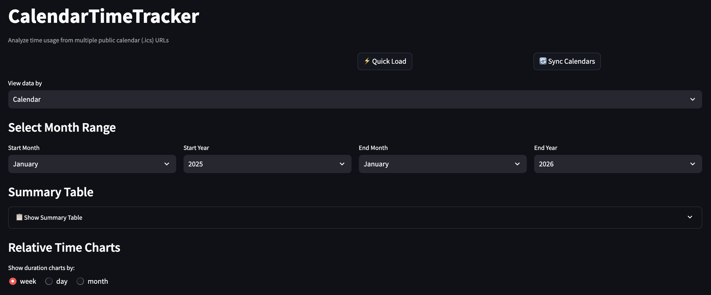
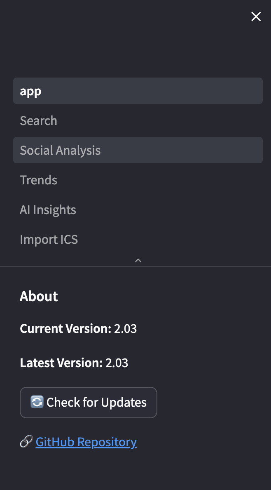
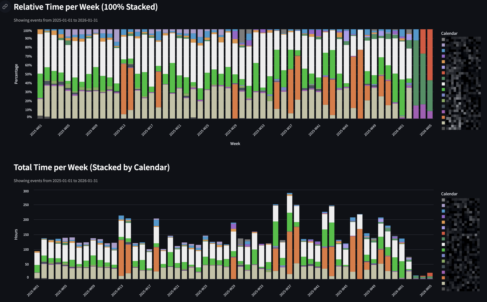
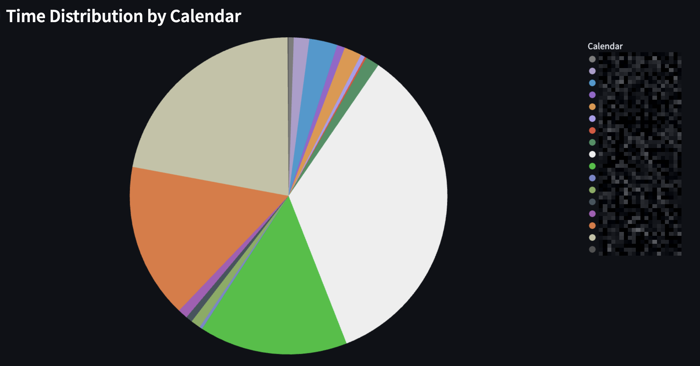
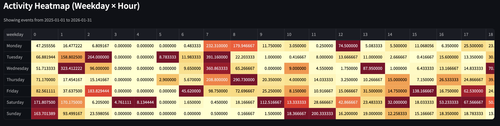
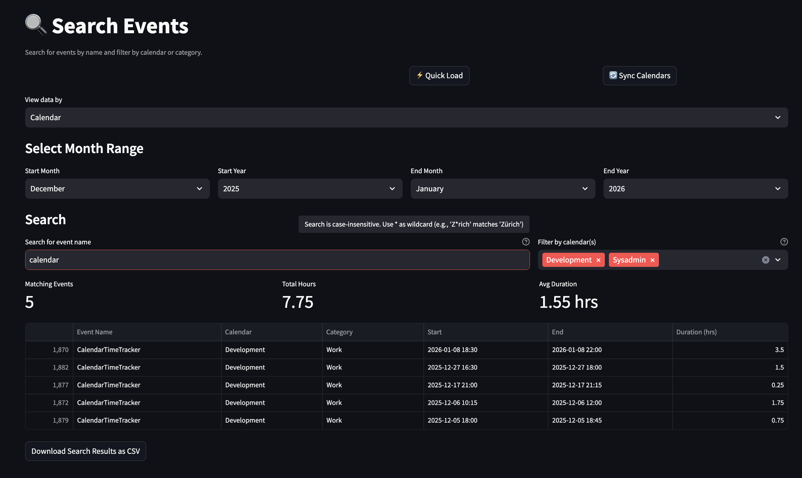
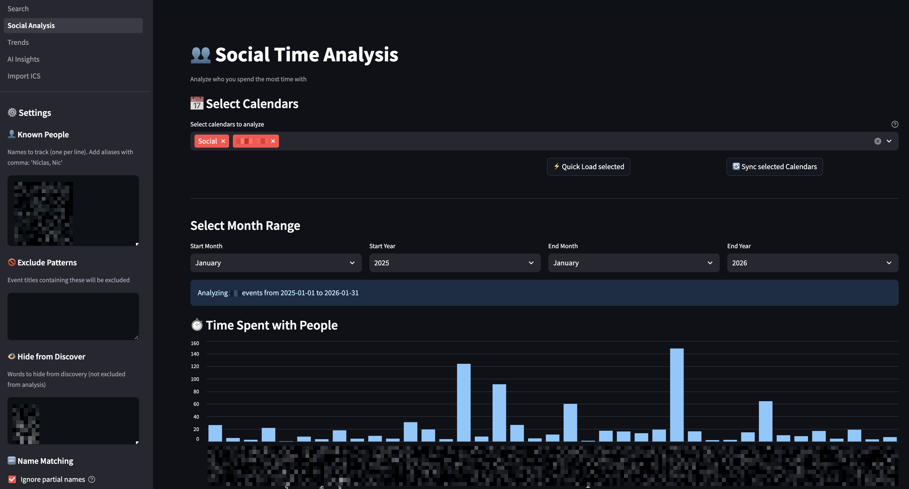
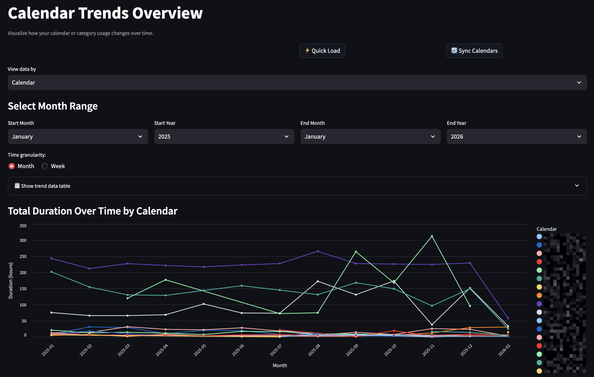
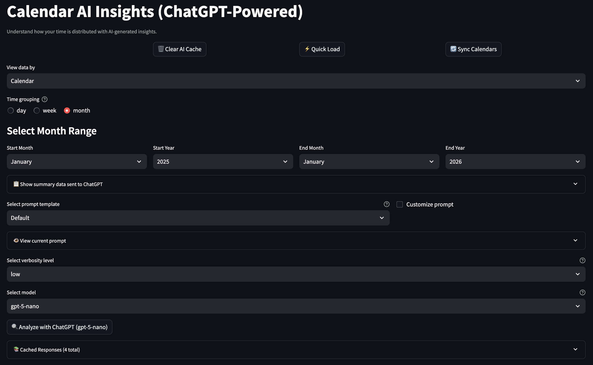
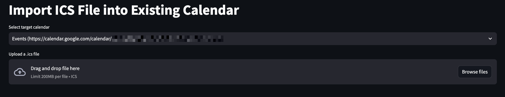

# CalendarTimeTracker

**CalendarTimeTracker** is a Streamlit (Python) app for analyzing how time is spent across multiple public `.ics` calendar URLs. It focuses on **event duration** rather than content and supports both **calendar-based** and **category-based** visualizations.

## 🚀 Features

- 📅 Load multiple calendars from `calendars.txt` or `calendars.json`
- 📊 Visualize total and relative time spent per day, week, or month
- 🔥 Activity heatmap (weekday × hour)
- 🍰 Pie chart for calendar/category time distribution
- 📦 Summary tables with CSV export (includes averages per day/week)
- 🔄 Dynamically switch between viewing by **Calendar** or **Category**
- 🎨 Custom calendar colors
- 🔍 Search page: Find calendar events by name with detailed views and metrics
- 👥 Social Analysis page: Analyze who you spend the most time with
- 📈 Trends page: visualize calendar activity over time using line and bar charts
- 🧠 AI Insights page: Calendar AI Insights (ChatGPT-Powered) with day/week/month time grouping
- 📂 Import ICS page: Upload and import `.ics` files into existing calendars
- 🌍 Time zone normalization support
- ⚡ **Cache-first loading** with instant page loads from local cache
- 🔄 **Background auto-refresh** syncs calendars every 24 hours automatically
- 💾 **Dual loading controls**: Quick Load (cache) and Sync Calendars (URLs) on every page
- 💫 Improved user experience with progress spinners and cache management

## 🏠 Home Dashboard












---

## ⚡ Performance Enhancements

CalendarTimeTracker v2.0 introduces major performance improvements:

### 🚀 Smart Caching Architecture
- **Cache-First Loading**: Pages load instantly from local CSV cache
- **Background Auto-Refresh**: Calendars sync automatically every 24 hours
- **24-Hour TTL**: Data stays fresh with automatic cache invalidation
- **Shared Cache**: All pages benefit from synced calendar data

### 🔄 New Loading Controls
- **⚡ Quick Load**: Load instantly from local cache
- **🔄 Sync Calendars**: Fetch latest data from calendar URLs
- **Consistent UI**: Same button layout across all pages

### 📊 Optimized Data Processing
- **Vectorized Chart Calculations**: Duration charts render ~12x faster using pandas vectorized operations
- **Progressive Loading**: Data is loaded and processed in stages with visual feedback
- **Memory Efficiency**: Better session state management reduces memory footprint
- **Faster Navigation**: Cached results enable quicker page transitions

---

## 🔍 Search Events

Find calendar events by name with detailed views and metrics.



- **Dedicated Search Page**: Access via the sidebar navigation
- **Date Range Filtering**: Select month range to limit search scope
- **Search by Name**: Case-insensitive, partial match search for events
- **View Matching Events**: See all occurrences with start/end times and duration
- **Summary Metrics**: Get total matching events, total hours, and average duration
- **CSV Download**: Download search results as CSV for external analysis
- **Calendar/Category Filter**: Optionally filter search results by calendar or category (based on selected view mode)

---

### 👥 Social Time Analysis

Analyze who you spend the most time with based on calendar event titles.



- **Track People**: Add names to track and see total hours spent with each person
- **Aliases/Nicknames**: Add comma-separated aliases (e.g., "Niclas, Nic") to group variations
- **Discover Names**: Automatically find frequently occurring words in your events
- **Date Filtering**: Analyze specific time periods with month/year selectors
- **Event Details**: See all events for each tracked person (sorted A-Z)
- **Statistics**: View hours, event count, average and median duration per person
- **Last Seen**: Track when you last met with each person
- **Ignore Partial Names**: Prevent "john" from matching events with "john doe" when both are tracked
- **Exclude Patterns**: Filter out generic events like "team meeting" or "community time"
- **Hide from Discover**: Hide irrelevant words from the discovery list without excluding events
- **Persistent Settings**: All configurations saved to `social_analysis_settings.json` (sorted alphabetically)

---

### 📈 Calendar Trends Overview

Understand how your calendar activity evolves over time.



- Switch between daily, weekly, and monthly granularity
- Useful for spotting workload peaks and recurring patterns

---

### 🧠 Calendar AI Insights (ChatGPT-Powered)

Get intelligent analysis of your calendar data with AI-powered insights.



- **Time Grouping**: Analyze patterns by day, week, or month
- **Temporal Analysis**: Identify trends and patterns over time periods
- **Smart Insights**: AI provides recommendations for time management and workload optimization
- **Customizable Prompts**: Modify the AI assistant behavior to focus on specific aspects
- **Multiple Models**: Choose from different GPT model variants for analysis depth

---

### 📂 Import ICS File

Upload `.ics` files and assign them to specific calendars configured via `calendars.json` or `calendars.txt`.



---

## 📦 Requirements
Install dependencies:

```bash
pip install -r requirements.txt
```
Optionally an OpenAI API key with access to GPT models for further insights.

## 🛠 Installation

Use the install script to get the project up and running on your local machine:

```bash
bash install.sh
```

## ⚙️ Configuration

You can configure calendars in two ways with samples provided:

### Option 1: `calendars.txt`

A plain text file where each line contains a calendar URL and an optional name.

### Option 2: `calendars.json` (Preferred)

Supports rich metadata like category assignment and custom calendar colors.

If `calendars.json` is present, it will be used automatically and enables category-based grouping.

### AI Configuration: `ai_config.json`

Configure AI analysis behavior by creating an `ai_config.json` file (see `ai_config.json.sample` for reference):

- **Custom Prompts**: Define different analysis styles (detailed, quick summary, productivity focus, etc.)
- **UI Settings**: Control prompt customization and display options
- **Auto-Configuration**: If `ai_config.json` is missing, it will be automatically created from `ai_config.json.sample`

## ▶️ Running the App

```bash
streamlit run app.py
```

The app will:

1. Load events from `.ics` calendar sources
2. Ask you to select a view mode (Calendar or Category) if using `calendars.json`
3. Let you choose a month range to analyze (defaults to last 12 months)
4. Display multiple interactive charts and tables

## 📂 Output

- All data stays local
- Summary tables can be downloaded as CSV
- Visuals include tooltips and interactive features

## 🧠 Notes

- Time zone normalization supports local, UTC, and naive modes.
- Duplicate events are filtered using the event `UID` field.
- **Cache-first loading**: Pages load instantly from local CSV cache in `data/`.
- **Background auto-refresh**: Calendars sync automatically 5 minutes before the 24-hour cache expires.
- **In-app updates**: Check for updates and pull latest version directly from the sidebar.
- Multi-day events are properly handled with proportional time distribution.
- Events from the **past 30 days and all future dates** are automatically re-synced with the source `.ics` file.
  - If an event is **removed** from the source calendar, it will also be **removed from the local cache**.
  - Events **older than 30 days** are preserved for historical reference, even if they no longer exist in the source.
- Version checking automatically notifies you of updates from GitHub.
- Summary tables include per-day and per-week averages for better insights.

## 🙌 Contribution

Contributions are welcome! Please fork the repository, create a new branch for your changes, and submit a pull request.

## 📄 License

This project is licensed under the [MIT License](LICENSE).

## ⚠️ Disclaimer

Use this tool at your own risk. Ensure you have proper backups and permissions before running the script in a production environment.

## 👤 Author

Developed by [ramhee98](https://github.com/ramhee98). For questions or suggestions, feel free to open an issue in the repository.
