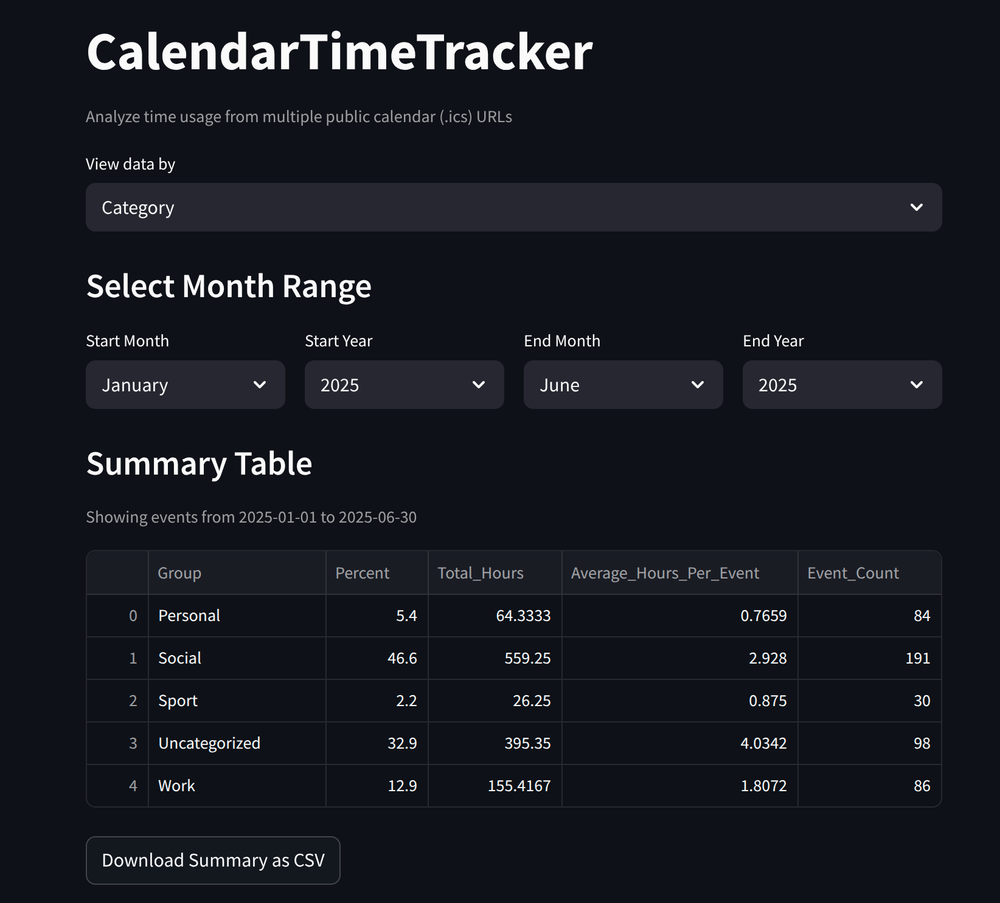
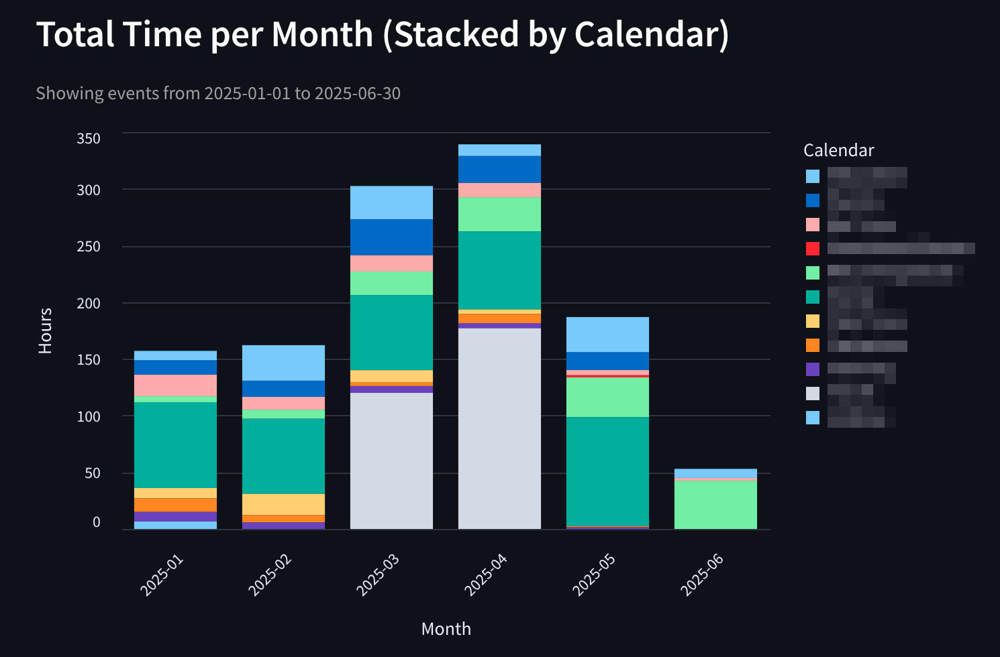
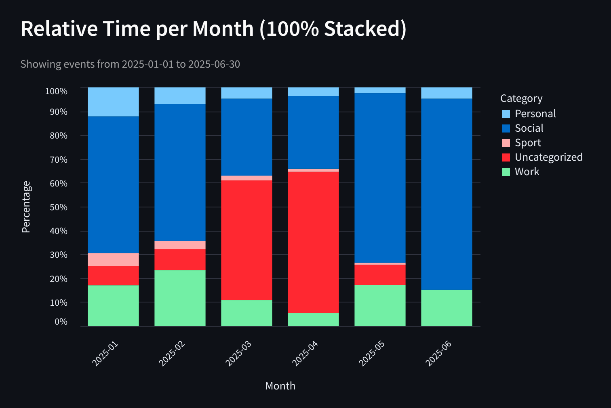
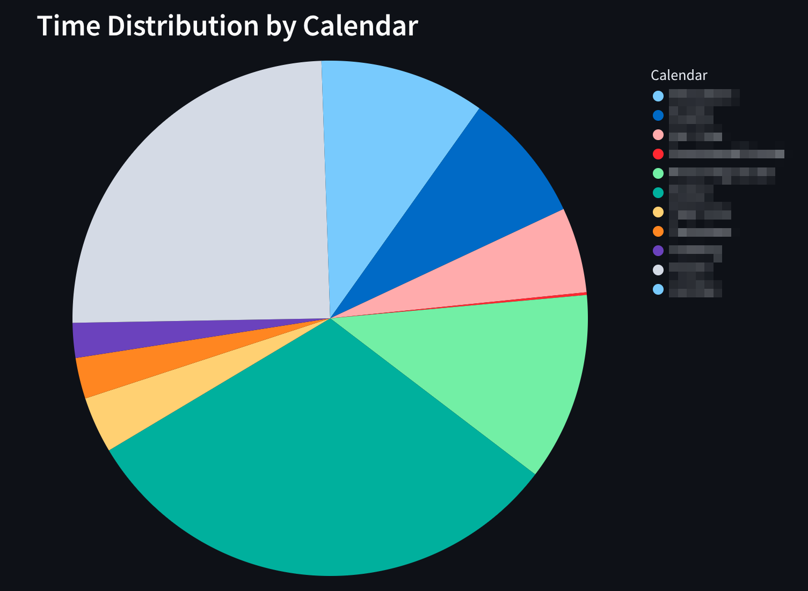
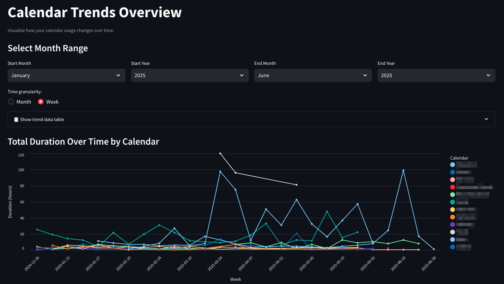
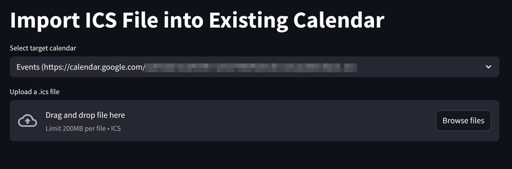

# CalendarTimeTracker

**CalendarTimeTracker** is a Streamlit (Python) app for analyzing how time is spent across multiple public `.ics` calendar URLs. It focuses on **event duration** rather than content and supports both **calendar-based** and **category-based** visualizations.

## 🚀 Features

- 📅 Load multiple calendars from `calendars.txt` or `calendars.json`
- 📊 Visualize total and relative time spent per day, week, or month
- 🔥 Activity heatmap (weekday × hour)
- 🍰 Pie chart for calendar/category time distribution
- 📦 Summary tables with CSV export (includes averages per day/week)
- 🔄 Dynamically switch between viewing by **Calendar** or **Category**
- 🎨 Custom calendar colors
- 🔍 AI Insights page: Calendar AI Insights (ChatGPT-Powered) with day/week/month time grouping
- 📈 Trends page: visualize calendar activity over time using line and bar charts
- 📂 Import ICS page: Upload and import `.ics` files into existing calendars
- 🗄️ Local data storage with intelligent caching and event deduplication
- 🌍 Time zone normalization support
- ⚡ Performance optimizations with enhanced caching and loading states
- 🔄 Smart session management with page-specific loading indicators
- 💫 Improved user experience with progress spinners and cache management

## 🖼️ Screenshots

### 📋 Summary Table
Aggregate total hours, averages, and event counts per calendar or category.



---

### 📆 Total Time per Month (Stacked)
View absolute duration stacked per calendar each month.



---

### 📊 Relative Time per Month (100% Stacked)
Visualize how time is distributed each month, normalized to 100%.



---

### 🥧 Time Distribution by Calendar
See which calendar contributes most to your time allocation.



---

## ⚡ Performance Enhancements

CalendarTimeTracker v1.04 introduces significant performance improvements:

### 🚀 Smart Caching & Loading
- **Enhanced Cache Management**: Improved caching with informative loading spinners
- **Session State Optimization**: Page-specific loading states prevent unnecessary reprocessing
- **User-Friendly Progress Indicators**: Clear feedback during data loading, processing, and chart generation

### 🔄 Improved User Experience
- **Prominent Refresh Button**: Easy one-click cache clearing and data reload
- **Loading State Management**: Prevents UI blocking during heavy operations
- **Consistent Performance Patterns**: All pages follow optimized loading strategies

### 📊 Optimized Data Processing
- **Progressive Loading**: Data is loaded and processed in stages with visual feedback
- **Memory Efficiency**: Better session state management reduces memory footprint
- **Faster Navigation**: Cached results enable quicker page transitions

---

### 📈 Trends Overview

Understand how your calendar activity evolves over time.

- Switch between daily, weekly, and monthly granularity
- Useful for spotting workload peaks and recurring patterns



---

### 🧠 AI Insights (ChatGPT-Powered)

Get intelligent analysis of your calendar data with AI-powered insights.

- **Time Grouping**: Analyze patterns by day, week, or month
- **Temporal Analysis**: Identify trends and patterns over time periods
- **Smart Insights**: AI provides recommendations for time management and workload optimization
- **Customizable Prompts**: Modify the AI assistant behavior to focus on specific aspects
- **Multiple Models**: Choose from different GPT model variants for analysis depth

---

### 📥 Importing `.ics` into a Calendar
Upload `.ics` files and assign them to specific calendars configured via `calendars.json` or `calendars.txt`.



## 📦 Requirements
Install dependencies:

```bash
pip install -r requirements.txt
```
Optionally an OpenAI API key with access to GPT models for further insights.

## 🛠 Installation

Use the install script to get the project up and running on your local machine:

```bash
bash install.sh
```

## ⚙️ Configuration

You can configure calendars in two ways with samples provided:

### Option 1: `calendars.txt`

A plain text file where each line contains a calendar URL and an optional name.

### Option 2: `calendars.json` (Preferred)

Supports rich metadata like category assignment and custom calendar colors.

If `calendars.json` is present, it will be used automatically and enables category-based grouping.

### AI Configuration: `ai_config.json`

Configure AI analysis behavior by creating an `ai_config.json` file (see `ai_config.json.sample` for reference):

- **Custom Prompts**: Define different analysis styles (detailed, quick summary, productivity focus, etc.)
- **UI Settings**: Control prompt customization and display options
- **Auto-Configuration**: If `ai_config.json` is missing, it will be automatically created from `ai_config.json.sample`

## ▶️ Running the App

```bash
streamlit run app.py
```

The app will:

1. Load events from `.ics` calendar sources
2. Ask you to select a view mode (Calendar or Category) if using `calendars.json`
3. Let you choose a month range to analyze
4. Display multiple interactive charts and tables

## 📂 Output

- All data stays local
- Summary tables can be downloaded as CSV
- Visuals include tooltips and interactive features

## 🧠 Notes

- Time zone normalization supports local, UTC, and naive modes.
- Duplicate events are filtered using the event `UID` field.
- Intelligent caching reduces repeated loads for unchanged calendars.
- Multi-day events are properly handled with proportional time distribution.
- Events from the **past 30 days and all future dates** are automatically re-synced with the source `.ics` file.
  - If an event is **removed** from the source calendar, it will also be **removed from the local cache**.
  - Events **older than 30 days** are preserved for historical reference, even if they no longer exist in the source.
- Version checking automatically notifies you of updates from GitHub.
- Summary tables include per-day and per-week averages for better insights.

## 🙌 Contribution

Contributions are welcome! Please fork the repository, create a new branch for your changes, and submit a pull request.

## 📄 License

This project is licensed under the [MIT License](LICENSE).

## ⚠️ Disclaimer

Use this tool at your own risk. Ensure you have proper backups and permissions before running the script in a production environment.

## 👤 Author

Developed by [ramhee98](https://github.com/ramhee98). For questions or suggestions, feel free to open an issue in the repository.
